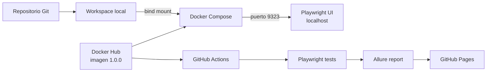

# Guía técnica

Esta guía describe el modelo técnico de Docker Playwright Lab. El
[README principal](../README.md) contiene el recorrido didáctico y el quick
start.

## Objetivo y alcance

El proyecto valida tres formas de consumir un entorno reproducible:

| Consumidor | Mecanismo | Propósito |
| --- | --- | --- |
| Developer | Docker Compose | Desarrollo y ejecución local interactiva. |
| GitHub Actions | Job container | Pruebas automatizadas y reportes. |
| Ejecución aislada | `docker run` | Validación del artefacto empaquetado. |

Playwright actúa como carga de trabajo representativa porque necesita Node.js,
tres motores de navegador y dependencias nativas. Esto hace visible el valor de
una imagen consistente sin requerir una aplicación productiva completa.

## Arquitectura



## Imagen

La imagen deriva de:

```dockerfile
FROM mcr.microsoft.com/playwright:v1.61.1-noble
```

La versión coincide con `@playwright/test` en `package.json`. Esta alineación es
importante: una versión diferente puede buscar ejecutables de navegador que no
existen en la imagen.

El build:

1. Establece `/app` como directorio de trabajo.
2. Copia primero los manifests de npm para aprovechar el caché de capas.
3. Ejecuta `npm ci`.
4. Copia el resto del repositorio.
5. Define `npm test` como comando predeterminado.

La imagen puede validarse directamente:

```powershell
docker run --rm aldimh/docker-playwright-demo:1.0.0
```

Los archivos generados en esa modalidad permanecen dentro del contenedor y se
eliminan con `--rm`, salvo que se monten volúmenes explícitos.

## Modelo de desarrollo con Compose

Compose monta dos volúmenes:

```yaml
volumes:
  - .:/workspace
  - node_modules:/workspace/node_modules
```

El bind mount `.:/workspace` mantiene el código en el host. La imagen aporta el
runtime y las dependencias del sistema, mientras el developer edita con sus
herramientas habituales.

El volumen nombrado `node_modules` evita escribir dependencias Linux en Windows
y sobrevive a los contenedores temporales. `npm ci` se ejecuta en `/workspace`
porque el montaje no utiliza el `/app/node_modules` incluido en la imagen.

Esta separación es deliberada:

```text
Imagen
└── runtime estable: Node + navegadores + librerías del sistema

Workspace montado
└── código cambiante del developer

Volumen nombrado
└── dependencias npm del workspace
```

## Playwright UI y publicación de puertos

Playwright UI es un servidor web. Dentro del contenedor se inicia con:

```text
--ui-host=0.0.0.0 --ui-port=9323
```

Escuchar en `0.0.0.0` es necesario para aceptar tráfico dirigido hacia la
interfaz de red del contenedor. Compose publica el puerto así:

```yaml
ports:
  - "127.0.0.1:9323:9323"
```

El primer `9323` es el puerto publicado en el host y el segundo es el puerto
objetivo dentro del contenedor. La IP `127.0.0.1` evita exponer la UI a otras
máquinas de la red local.

`docker compose run` no publica los puertos del servicio de forma predeterminada.
Por eso UI Mode requiere:

```powershell
docker compose run --rm --service-ports dev npm run test:ui:docker
```

## Uso en GitHub Actions

El workflow declara la imagen como entorno del job:

```yaml
container:
  image: aldimh/docker-playwright-demo:1.0.0
```

GitHub Actions no ejecuta automáticamente el `CMD` del Dockerfile. En cambio,
crea el contenedor y ejecuta los `steps` del workflow dentro de él.

`actions/checkout` monta el repositorio en el workspace de Actions, no en `/app`.
Por esa razón el pipeline conserva:

```yaml
- name: Install dependencies
  run: npm ci
```

Luego ejecuta las pruebas con Allure. Los reportes se crean en el workspace
montado, de modo que los pasos posteriores pueden publicarlos aunque el
contenedor sea descartable.

## Versionado y reproducibilidad

El workflow consume una versión explícita:

```text
aldimh/docker-playwright-demo:1.0.0
```

Esto es más reproducible que depender de `latest`. En una evolución corporativa
se recomienda:

- Publicar un tag semántico para consumo humano.
- Publicar también un tag asociado al commit.
- Usar el digest `sha256` en ejecuciones que requieran inmutabilidad estricta.
- Construir una sola vez y promover el mismo artefacto entre ambientes.

La publicación actual es manual. Esto permite aprender primero las operaciones
`build`, `tag`, `login`, `push` y `pull` antes de automatizarlas.

## Consideraciones de seguridad

La imagen oficial utilizada ejecuta procesos como `root`. Playwright acepta este
modelo para pruebas end-to-end sobre sitios confiables, pero Chromium no dispone
de su sandbox habitual en esa modalidad.

Para esta POC:

- Se ejecuta código controlado por el repositorio.
- El destino de prueba es confiable.
- Los contenedores son temporales.
- El puerto de UI se publica únicamente en loopback.

Una iteración endurecida debería evaluar:

- Ejecutar como `pwuser`.
- Usar el perfil `seccomp` recomendado por Playwright.
- Evitar montajes sensibles y el socket de Docker.
- Limitar secretos y permisos del workflow.
- Escanear imagen y dependencias.
- Fijar imágenes y acciones por versiones inmutables.

## Artefactos y persistencia

`.dockerignore` evita enviar dependencias, reportes y resultados al contexto de
build. `.gitignore` evita versionar esos mismos artefactos en Git. Son controles
distintos y ambos son necesarios.

En desarrollo, los resultados creados bajo `/workspace` quedan en el host debido
al bind mount. En una ejecución directa con `docker run --rm`, deben montarse
directorios si se desea conservarlos:

```powershell
docker run --rm `
  -v "${PWD}/allure-report:/app/allure-report" `
  -v "${PWD}/allure-results:/app/allure-results" `
  aldimh/docker-playwright-demo:1.0.0
```

## Diagnóstico rápido

### `ERR_ADDRESS_INVALID` al abrir `0.0.0.0`

Abrir <http://localhost:9323>. `0.0.0.0` es una dirección de escucha, no una
dirección de navegación.

### UI Mode escucha, pero `localhost` no responde

Confirmar que el comando incluya `--service-ports` y revisar:

```powershell
docker ps
docker compose port dev 9323
```

### `Missing script: test:ui:docker`

Confirmar que `package.json` esté guardado y visible bajo `/workspace`:

```powershell
docker compose run --rm dev npm run
```

### Faltan dependencias

Crear o actualizar el volumen:

```powershell
docker compose run --rm dev npm ci
```

### Se necesita reiniciar completamente el entorno

```powershell
docker compose down --volumes
docker compose pull
docker compose run --rm dev npm ci
```

## Próximas iteraciones

1. Renombrar y publicar la imagen como `aldimh/docker-playwright-lab`.
2. Automatizar build y publicación mediante tags Git.
3. Agregar caché de BuildKit y metadatos OCI.
4. Generar SBOM y escanear vulnerabilidades.
5. Probar una variante non-root.
6. Aplicar permisos mínimos por job en GitHub Actions.
7. Fijar una estrategia explícita de actualización de Playwright y su imagen.
